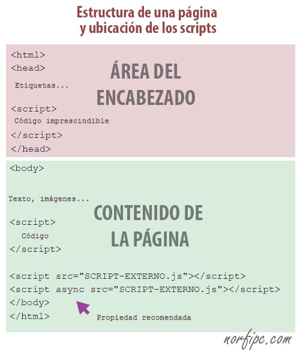

## Cuestionario Review JS 👩🏻‍💻 👨🏻‍💻
----------------------------------------------------------------------------------------------------------------
- ¿Que es javascript?
----------------------------------------------------------------------------------------------------------------
- ¿Cómo puedo crear mi código Javscript?
    <details><summary><b>Respuesta</b></summary>
    
    </details
----------------------------------------------------------------------------------------------------------------
- ¿Que tipo de funciones existen en javascript?

- Los siguientes datos, ¿qué tipos de datos son?

    ```js
    3.14
    "Shazam!"
    true
    100
    ```

    <details><summary><b>Respuesta</b></summary>
    <p>
    Son tipos de datos primitivos

    - 3.14 y 100 son number 
    - "Shazam!" es string 
    - true es boolean 

    **Hint:** otros tipos primitivos: BigInit, Symbol, undefined. Los tipos primitivos son immutable 
    </p>
    </details>
------------------------------------------------------------------------------------------------------------------
- ¿Cuáles son los otros tipos de datos?
    <details><summary><b>Respuesta</b></summary>
    <p>

    - Object
    - Null(tiene un comportamiento especial, puede heredar de object pero tambien se puede considerar primitivo)
    - Function (es el unico Objeto que es un tipo de dato)

    </p>
    </details 
------------------------------------------------------------------------------------------------------------------

- ¿Para qué y cómo se utilizado typeof?

    <details><summary><b>Respuesta</b></summary>
    <p>
    Con typeof podemos saber de que tipo es una varibale o un dato.

    ```js 
    console.assert( typeof 100 === "number") 
    ``` 
    ```js
    // String 
    const message = "Sol Solecito no me calientes tanto!"
    console.assert( typeof mesage === "string")  

    // Symbol
    typeof Symbol('UniqueId')

    //?
    console.assert( typeof Symbol === 'function')
    console.assert( typeof Number === 'function')
    console.assert( typeof String === 'function')
    ``` 

    **Hint:** Los tipos primitivos a  excepción de undefined no tienen ni métodos ni son objetos pero javascript hace un wrapper para cada uno de los tipos para hacernos la vida más fácil y poder hacer cosas como ```"twitter sólo permite 150 letras".length()```, por eso typeof Number es tipo function 
    </p>
    </details 
------------------------------------------------------------------------------------------------------------------
- ¿Para qué se utilizado instanceOf?
    ```js 
        const fecha = new Date()
       console.log(fecha instanceof Date)
       console.log(fecha instanceof Object)  
    ``` 

    <details><summary><b>Respuesta</b></summary>
    <p>
        Para los objetos existe una instrucción bastante práctica que permite conocer si un objeto determinado es una instancia de una clase superior. De esta forma podemos comprobar si un determinado dato es de tipo Date, Array, etc.

    ```js 
        const sayHi = () => {console.log('Hola!')}
        console.log( sayHi instanceof Function)
        console.log( sayHi instanceof Object)
    ``` 

    **Hint:** La strategia de evaluación cambia entre el tipo primitivo string y el wrapper String 

    ```js
        // Primitive type string
        var testString = 'text';
        console.assert( typeof testString === 'string' );
        console.assert( testString instanceof Object === false );
        console.assert( testString instanceof String === false );
        console.assert( Object.prototype.toString.call(testString) === '[object String]' );
        console.assert( testString.constructor.name === 'String' );
        // Object String
        var testStringObject = new String('text');
        console.assert( typeof testStringObject === 'object' );
        console.assert( testStringObject instanceof Object === true );
        console.assert( testStringObject instanceof String === true );
        console.assert( Object.prototype.toString.call(testStringObject) === '[object String]' );
        console.assert( testStringObject.constructor.name === 'String' );
    ``` 
    </p>
    </details 
------------------------------------------------------------------------------------------------------------------
- ¿Que es NaN ?
    <details><summary><b>Respuesta</b></summary>
    <p>
    Es una propiedad global en JS que indica que un resultado evaluado no es un numero  Not-A-Number

    ```js
        console.log( parseInt('no se encontro la cantidad') )
    ```
    **Hint** ironicamente NaN es tipo number y hay que tener cuidado con el manejo de los numeros, en lo posible validar que no sean NaN 
    ```js
        console.log(typeof NaN)
        console.log( x <= 100 )
        console.log( x > 100 )
    ```
    </p>
    </details 
------------------------------------------------------------------------------------------------------------------
- ¿Que es undefined y Cuál es el resultado de typeof undefined?
------------------------------------------------------------------------------------------------------------------
- ¿Qué es una variable, Cómo se puede declarar?
------------------------------------------------------------------------------------------------------------------
- ¿Cómo se puede asignar un valor a una variable? (Asignacion por valor o por referencia) 
----------------------------------------------------------------------------------------------------------------
- ¿Qué es hosting?
------------------------------------------------------------------------------------------------------------------
- ¿ Cual de las siguientes variables es undefined y cual es not defined?
```js
    console.log(neverDeclare)
    console.log(forgetDeclareBefore)

    let forgetDeclareBefore;
    var neverDeclare;

```
- ¿ Cual de las siguientes variables es undefined y cual es not defined?
```js
    console.log(neverDeclare)
    console.log(forgetDeclareBefore)

    var neverDeclare;
```
------------------------------------------------------------------------------------------------------------------
- ¿Qué es un objeto?
    <details><summary><b>Respuesta</b></summary>
    <p>
        Es una colección de datos, conformada por clave y valor.
    </p>
    </details 
-----------------------------------------------------------------------------------------------------------------
- ¿Qué es una función?
    <details><summary><b>Respuesta</b></summary>
    <p>
        un conjunto de sentencias que realizan una tarea o calculan un valor. 
    </p>
    </details 
-----------------------------------------------------------------------------------------------------------------
- ¿Que son los parametros en una función?
----------------------------------------------------------------------------------------------------------------
- ¿Cómo se puede definir un parametro por deafult en una función?
----------------------------------------------------------------------------------------------------------------
- ¿Que tipo de funciones existen en javascript?
----------------------------------------------------------------------------------------------------------------
- ¿Cuàl es la diferencia entre un mètodo, un constructor y una funciòn?
------------------------------------------------------------------------------------------------------------------
- ¿Qué es un closure ?
    <details><summary><b>Respuesta</b></summary>
    <p>
    Un closure es una característica que tiene JavaScript de que una función al ejecutarse, recuerde el entorno en la que fue creada. Por ejemplo:

    ```js
    var text = 'Mundo';
    function bar() {
    var text = 'Bootcamp';
    function foo() {
        console.log('hola ' + text);
    }
    return foo;
    }
    var willItPrint = bar();
    willItPrint();
    ```

    Esta funcion imprimirá 'hola mundo', sin ningun problema.

    Ahora, consideremos lo siguiente:


    Si bien estamos definiendo en 2 lugares la variable text, al momento de definir la función foo la variable text tiene el valor de 'mundo'. La funcion foo la estamos devolviendo y guardando en la variable willItPrint por lo que independiente de el momento en el que llamemos a la funcion guardada en esa variable, el resultado será:

    "hola Bootcamp";
    </p>
    </details>
-----------------------------------------------------------------------------------------------------------------
- ¿Es Javascript asincrono?
-----------------------------------------------------------------------------------------------------------------
- ¿Qué es una promesa?
    <details><summary><b>Respuesta</b></summary>
    <p>
        Guarda el resultado de una operación que va a ser ejecutada en el futuro.
        Creación:
    </p>

    ```js
        var promise = new Promise(function(resolve, reject) {
        // do a thing, possibly async, then…

        if (/* everything turned out fine */) {
            resolve("Stuff worked!");
        }
        else {
            reject(Error("It broke"));
        }
        });
    ```
     <p>
        Uso:
    </p>

    ```js
        promise.then(function(result) {
            console.log(result); // "Stuff worked!"
        }, function(err) {
            console.log(err); // Error: "It broke"
        });
    ```
    </details>
-----------------------------------------------------------------------------------------------------------------
- ¿Cuales son los estados de una promesa?
    <details><summary><b>Respuesta</b></summary>
    <p>
        -Pending. Estado inicial.
        -Resolved. La operación terminó con éxito.
        -Rejected. La operación terminó con un error.
    </p>
    </details>
-----------------------------------------------------------------------------------------------------------------
- ¿Qué es un Array?
    <details><summary><b>Respuesta</b></summary>
    <p>
       Es una colección de datos, los datos pueden ser de diferente tipo 
    </p>
    </details>
----------------------------------------------------------------------------------------------------------------
- ¿Qué metodos podemos usar para leer o saber que valores tiene un array?
----------------------------------------------------------------------------------------------------------------
- ¿Cómo se puede agregar un item a un Array?
    <details><summary><b>Respuesta</b></summary>
    
    </details
----------------------------------------------------------------------------------------------------------------
- ¿ qué es un callback ?
    <details><summary><b>Respuesta</b></summary>
    <p>
        Es una función que se pasa como parametro a otra función  y la otra función es quien la ejecuta 
    </p>
    </details
----------------------------------------------------------------------------------------------------------------
- ¿ que es async away?


## Referencias 
Varias respuestas y preguntas se sacaron de los siguientes enlaces: 

https://github.com/fforres/preguntas-y-respuestas-entrevistas-frontend/tree/master/js
https://github.com/lydiahallie/javascript-questions/blob/master/es-ES/README-ES.md
https://github.com/ganqqwerty/123-Essential-JavaScript-Interview-Questions
https://github.com/sudheerj/javascript-interview-questions
https://github.com/yangshun/front-end-interview-handbook/blob/master/contents/en/javascript-questions.md

## Blog 
https://blog.bitsrc.io/hoisting-in-modern-javascript-let-const-and-var-b290405adfda


